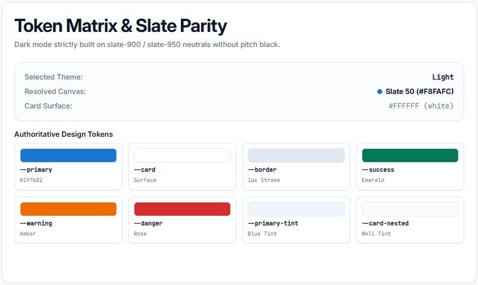

# @ad-technology-inc/design-system

A premium, state-of-the-art CSS-first Design System built for modern SaaS applications. Compatible with vanilla HTML/CSS and fully integrated with Tailwind CSS v4.

---

## 🚀 Installation

Install the package via your preferred package manager:

```bash
npm install @ad-technology-inc/design-system
# or
yarn add @ad-technology-inc/design-system
# or
pnpm add @ad-technology-inc/design-system
```

---

## 🛠️ Usage

### 1. Vanilla CSS Integration
Import the clean CSS bundle into your main stylesheet:

```css
@import "@ad-technology-inc/design-system";
```

### 2. Tailwind CSS v4 Integration
If your project is built with Tailwind CSS v4, import Tailwind and then load our theme wrapper stylesheet:

```css
@import "tailwindcss";

/* Imports all components and links theme variables to Tailwind v4 */
@import "@ad-technology-inc/design-system/app.css";
```

#### Configuring Dark Mode:
By default, Tailwind CSS v4 handles dark mode using media queries. If your project uses class-based dark mode (e.g. toggling `.dark` class on the `<html>` element), define the custom variant in your stylesheet:

```css
@import "tailwindcss";
@custom-variant dark (&:is(.dark *)); /* Only add if using class-based dark mode */

@import "@ad-technology-inc/design-system/app.css";
```

#### Disabling Dark Mode (Light Mode Only):
If you want to disable dark mode entirely and force your website to stay in light mode (even if the user's OS prefers dark mode), simply add the `light` class to your root `<html>` element:

```html
<html class="light">
```
This disables the built-in prefers-color-scheme media query and keeps the light-mode variables active.

---

## 🎨 Theme Variables & Customization

The design system is engineered for modern B2B SaaS interfaces. It exposes slate neutrals, brand blue (`#1976D2`), micro-elevations (`shadow-xs`), and strict mathematical corner radii:

```css
:root {
  --primary: #1976d2;           /* Primary brand action */
  --primary-hover: #1565c0;     /* Hover state */
  --primary-active: #0d47a1;    /* Active state */
  --radius-xl: 0.75rem;         /* Page containers, cards, modals */
  --radius-lg: 0.5rem;          /* Action buttons, form inputs */
  --radius-md: 0.375rem;        /* Badges, table chips, segmented tabs */
}

.dark {
  --background: #020617;        /* Deep slate-950 canvas (no pitch black) */
  --card: #0f172a;              /* Slate-900 surface */
  --border: #1e293b;            /* Crisp 1px border */
}
```


### Core Semantic Tokens Available:
* `--background` / `--foreground`: Base canvas (`slate-50` / `slate-950`) & text
* `--card` / `--card-nested`: Surfaces & cluster wells (`slate-50/70` / `slate-800/40`)
* `--primary` / `--primary-hover` / `--primary-active` / `--primary-foreground`: Brand actions (`#1976D2`)
* `--primary-tint` / `--primary-border`: Subtle brand highlighting
* `--secondary` / `--secondary-hover` / `--secondary-foreground`: Secondary actions
* `--accent` / `--accent-hover` / `--accent-foreground`: Interactive highlights
* `--neutral` / `--neutral-hover` / `--neutral-foreground`: Muted helpers and subtle backgrounds
* `--border`: Structural container borders (`slate-200` / `slate-800`)
* `--success` / `--warning` / `--info` / `--danger`: High-contrast semantic indicators (Emerald, Amber, Blue, Rose)
* `--radius-xl` / `--radius-lg` / `--radius-md` / `--radius-full`: Geometry scale
* `--shadow-xs` / `--shadow-lg` / `--shadow-xl`: Crisp micro-elevation hierarchy

---

## ⚡ Component & Layout Reference

The package includes pre-styled, accessibility-compliant CSS components with zero AI artifacts (no purple orbs, no decorative emojis, no indiscriminate pill badges):

- **`.button`**: Standardized, transition-ready buttons with `rounded-lg` and `shadow-xs`. Variants: `.button-primary`, `.button-secondary`, `.button-outline`, `.button-destructive`, `.button-ghost`, `.button-icon`, and `.button-link`. Sizes: `.button-sm`, `.button-lg`.
- **`.segmented-switcher` & `.segmented-tab`**: Segmented view switchers.
- **`.card`**: 5-level container rhythm (`.card`, `.card-well`, `.card-tile`, `.icon-box`, `.stat-value`, `.stat-change`).
- **`.table-container` & `.table`**: Tabular ledgers with sticky headers, `.table-numeric` right-aligned monospace numbers, and `.table-footer` pagination.
- **`.form-group`**: Form elements:
  * `.form-input` / `.form-select` / `.form-textarea`: Form control fields with brand focus ring (`#1976D2`)
  * `.form-search`: Search input with inline icon positioning
  * `.form-error-banner`: Structured validation callout banner
  * `.form-file` / `.form-range` / `.form-checkbox` / `.form-radio`: Fully styled input components
- **`.badge`**: Rectangular status badges (`rounded-md uppercase tracking-wider`) with `.badge-dot` pulsing indicators and `.badge-mono` numeric chips. Never pill-shaped.
- **`.alert`**: Semantic feedback containers with 1px tinted borders (`.alert-success`, `.alert-warning`, `.alert-danger`, `.alert-info`).
- **`.dialog` & `.drawer`**: 5-region modal dialogs (`shadow-lg`, backdrop blur) and slide-over preview drawers (`shadow-xl`).
- **`.sidebar` & `.navbar`**: Collapsible sidebars with subtle blue tint active highlighting (`.sidebar-item.active`) and `.telemetry-pulse` operational indicators.

---

## 🔧 Local Development & Sandbox (Vue Playground)

If you are contributing to this design system project:

1. Clone the repository and install local dev dependencies:
   ```bash
   npm install
   ```
2. Start the Vue sandbox to preview components:
   ```bash
   npm run dev
   ```
3. Compile the production bundles:
   ```bash
   npm run build
   ```
